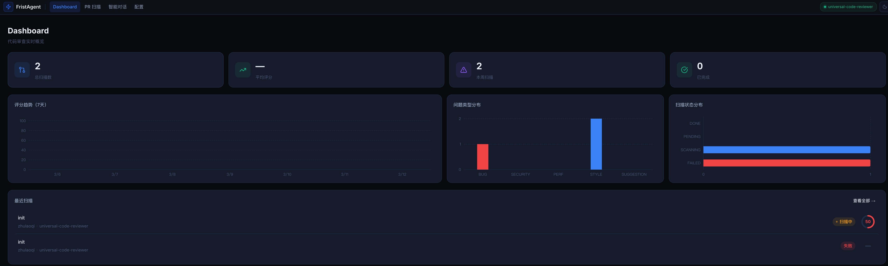
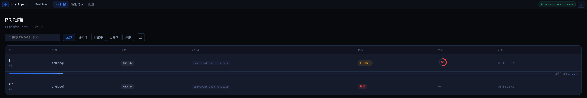
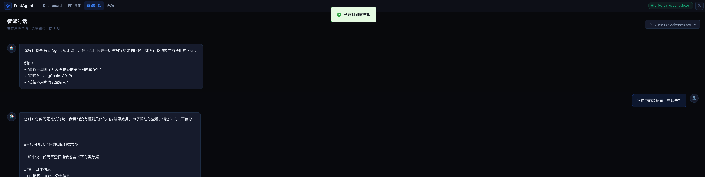
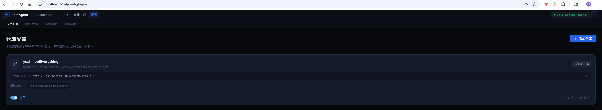
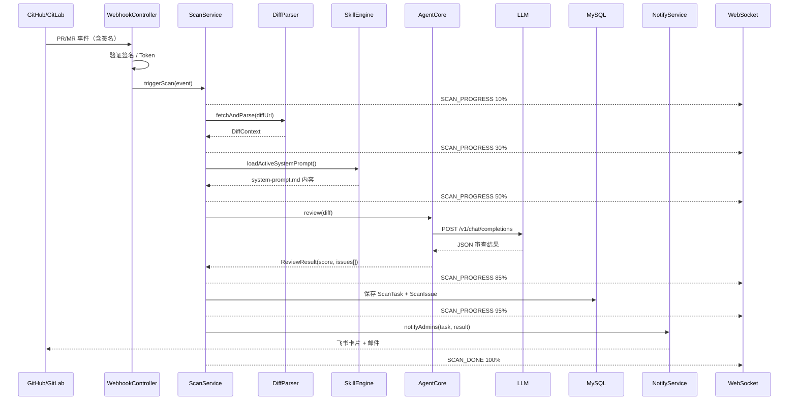

# FristAgent

> 智能 PR/MR 代码审查平台 —— 让每一次合并都经过 AI 把关

FristAgent 是一个面向研发团队的自动化代码审查系统，通过 Webhook 监听 GitHub / GitLab 的 PR/MR 事件，自动拉取代码差异，驱动可插拔的 AI Skill 进行深度分析，并将审查报告实时推送到开发者的飞书 / 邮件，同时通过 WebSocket 在 Web 控制台展示全程进度。

---

## 目录

- [功能特性](#功能特性)
- [系统架构](#系统架构)
- [技术栈](#技术栈)
- [快速开始](#快速开始)
  - [环境准备](#环境准备)
  - [数据库初始化](#数据库初始化)
  - [配置说明](#配置说明)
  - [启动后端](#启动后端)
  - [启动前端](#启动前端)
- [Skill 系统](#skill-系统)
  - [内置 Skill](#内置-skill)
  - [安装自定义 Skill](#安装自定义-skill)
  - [编写 Skill](#编写-skill)
- [Webhook 配置](#webhook-配置)
  - [GitHub](#github)
  - [GitLab](#gitlab)
- [API 文档](#api-文档)
- [项目结构](#项目结构)
- [开发指南](#开发指南)

---

## 界面预览

**Dashboard** — 扫描总览、评分趋势、问题分布



**PR 扫描列表** — 实时进度条、状态筛选



**智能对话** — 基于扫描历史的多轮 AI 问答



**配置中心** — 仓库、Skill、模型、通知一站式管理



---

## 功能特性

| 功能 | 说明 |
|------|------|
| **双平台 Webhook** | 同时支持 GitHub（HMAC-SHA256 签名校验）和 GitLab（Token 校验） |
| **可插拔 Skill** | Skill 以 Markdown 文件形式存在，无需重启即可热切换；支持从 GitHub 安装社区 Skill |
| **OpenAI 兼容协议** | 任何支持 `/v1/chat/completions` 的模型均可接入（OpenAI、DeepSeek、Qwen、Ollama 等） |
| **实时进度推送** | 扫描全程通过 WebSocket 实时广播，列表和详情页同步更新 |
| **多维度审查** | 安全漏洞（OWASP Top 10）、Bug 风险、性能反模式、代码规范、优化建议 |
| **智能评分** | 每次扫描输出 0-100 综合评分，可视化趋势图 |
| **通知推送** | 扫描完成后向仓库管理员发送飞书卡片消息 + HTML 邮件 |
| **智能对话** | 基于扫描历史的 AI 问答，对话记录持久化，多端共享 |
| **无需登录** | 内部工具定位，无鉴权依赖 |

---

## 系统架构

```mermaid
graph TB
    subgraph 代码托管平台
        GH[GitHub]
        GL[GitLab]
    end

    subgraph FristAgent Server
        WH[WebhookController<br/>签名验证]
        SS[ScanService<br/>@Async 异步]
        DP[DiffParser<br/>拉取&解析 Diff]
        SE[SkillEngine<br/>加载 system-prompt]
        AC[AgentCore<br/>格式化 + 调用 LLM]
        LLM[LlmGateway<br/>OpenAI 兼容协议]
        DB[(MySQL<br/>scan_task / scan_issue)]
        RD[(Redis<br/>热配置 / 缓存)]
        NS[NotifyService<br/>飞书 + 邮件]
        WS[WebSocketHandler<br/>实时广播]
    end

    subgraph FristAgent Web
        DASH[Dashboard<br/>统计 + 趋势图]
        LIST[PR 扫描列表<br/>实时进度条]
        DETAIL[扫描详情<br/>Issue 标注]
        CHAT[智能对话<br/>多轮持久化]
        CONF[配置中心<br/>仓库/Skill/模型]
    end

    GH -->|Webhook PR 事件| WH
    GL -->|Webhook MR 事件| WH
    WH --> SS
    SS --> DP
    SS --> SE
    SE <-->|active_skill 键| RD
    SS --> AC
    AC --> LLM
    LLM <-->|LLM 配置| RD
    AC --> DB
    SS --> NS
    SS --> WS

    WS -->|ws://localhost:8080/ws| LIST
    WS -->|SKILL_SWITCHED| CONF
    DB -->|REST /api| DASH
    DB -->|REST /api| LIST
    DB -->|REST /api| DETAIL
    DB -->|REST /api| CHAT
```

### 核心数据流



---

## 技术栈

### 后端

| 组件 | 版本 | 用途 |
|------|------|------|
| Java | 21 | 主语言，使用 Record、Virtual Threads 等特性 |
| Spring Boot | 3.2.5 | 应用框架 |
| Spring Data JPA | 3.2.x | ORM，MySQL 持久化 |
| Spring WebSocket | 3.2.x | 实时进度推送（TextWebSocketHandler） |
| Spring Data Redis | 3.2.x | Skill 热切换、LLM 配置热更新、飞书 Token 缓存 |
| MySQL | 8.0+ | 主数据库 |
| Redis | 6.0+ | 热配置中心 + 缓存 |
| Lombok | - | 减少样板代码 |

### 前端

| 组件 | 版本 | 用途 |
|------|------|------|
| Vue | 3.x | 响应式 UI 框架 |
| Vite | 5.x | 构建工具 |
| Element Plus | 2.x | UI 组件库 |
| ECharts + vue-echarts | - | 数据可视化 |
| Lucide Vue | - | 图标库 |
| Pinia | 2.x | 状态管理（Skill 状态 + 扫描进度） |
| Axios | - | HTTP 客户端（含统一错误拦截） |
| dayjs | - | 日期格式化 |

---

## 快速开始

### 环境准备

| 依赖 | 版本要求 |
|------|----------|
| JDK | 21+ |
| Maven | 3.8+ |
| Node.js | 18+ |
| MySQL | 8.0+ |
| Redis | 6.0+ |

### 数据库初始化

```sql
-- 1. 创建数据库
CREATE DATABASE fristagent DEFAULT CHARACTER SET utf8mb4 COLLATE utf8mb4_unicode_ci;

-- 2. Schema 会在应用启动时自动执行（spring.sql.init.mode=always）
--    也可手动执行：
-- mysql -u root -p fristagent < fristagent-server/src/main/resources/db/schema.sql
```

### 配置说明

编辑 `fristagent-server/src/main/resources/application.yml`，或通过环境变量覆盖：

```yaml
spring:
  datasource:
    url: jdbc:mysql://localhost:3306/fristagent?useUnicode=true&characterEncoding=utf8&serverTimezone=Asia/Shanghai
    username: root        # ← 修改为实际账号
    password: root        # ← 修改为实际密码

  data:
    redis:
      host: localhost
      port: 6379

fristagent:
  llm:
    endpoint: https://api.openai.com    # OpenAI 兼容接口地址
    api-key: sk-xxxxxxxxxxxxxxxxxxxx    # API Key
    model: gpt-4o                       # 模型名称

  skill:
    data-dir: ~/.fristagent/skills      # 自定义 Skill 存放目录（自动创建）

  feishu:
    app-id: cli_xxxxxx                  # 飞书自建应用 App ID（可选）
    app-secret: xxxxxx                  # 飞书自建应用 App Secret（可选）
```

**环境变量方式（推荐生产环境）：**

```bash
export LLM_ENDPOINT=https://api.deepseek.com
export LLM_API_KEY=sk-xxxxxxxxxxxxxxxxxxxx
export LLM_MODEL=deepseek-chat
export FEISHU_APP_ID=cli_xxxxxx
export FEISHU_APP_SECRET=xxxxxx
```

**支持的 LLM 提供商：**

| 提供商 | endpoint | model 示例 |
|--------|----------|------------|
| OpenAI | `https://api.openai.com` | `gpt-4o` |
| DeepSeek | `https://api.deepseek.com` | `deepseek-chat` |
| 阿里云百炼 | `https://dashscope.aliyuncs.com/compatible-mode` | `qwen2.5-72b-instruct` |
| Ollama（本地） | `http://localhost:11434` | `llama3.2` |
| 任意兼容端点 | 自定义 | 自定义 |

### 启动后端

```bash
cd fristagent-server

# 编译并运行
mvn spring-boot:run

# 或打包后运行
mvn clean package -DskipTests
java -jar target/fristagent-server-*.jar
```

后端默认监听 `http://localhost:8080`

### 启动前端

```bash
cd fristagent-web

# 安装依赖
npm install

# 开发模式（自动代理 /api 到 :8080）
npm run dev

# 生产构建
npm run build
```

前端开发服务器默认监听 `http://localhost:5173`

---

## Skill 系统

Skill 是 FristAgent 的审查大脑，以标准化 Markdown 文件格式定义。整个系统同时只有一个激活的 Skill，可随时热切换，无需重启。

### 内置 Skill

| Skill | 适用场景 |
|-------|----------|
| `universal-code-reviewer` | 通用代码审查，涵盖安全（OWASP Top 10）、Bug、性能、规范，支持 Java/Python/Go/JS/TS/C#/Rust |
| `langchain-cr-pro` | LLM 应用专项审查，识别 Prompt Injection、Token 泄露、异步阻塞等 AI 原生风险 |
| `team-style-enforcer` | 团队规范守护，可通过 `.style.yaml` 动态定制审查规则 |

### 安装自定义 Skill

在 Web 控制台的 **Skill 管理** 页面，点击「安装 Skill」，输入 GitHub 仓库地址：

```
https://github.com/owner/my-skill
```

系统将自动从仓库的 `main` 分支下载并安装。

也可以通过 API：

```bash
curl -X POST http://localhost:8080/api/skills/install \
  -H "Content-Type: application/json" \
  -d '{"githubUrl": "https://github.com/owner/my-skill"}'
```

### 编写 Skill

一个 Skill 仓库至少包含以下两个文件：

**`skill.yaml`** — Skill 元数据

```yaml
name: my-code-reviewer
displayName: My Code Reviewer
version: 1.0.0
description: 专注于 Go 语言最佳实践的审查器
```

**`system-prompt.md`** — 审查指令（System Prompt）

````markdown
你是一位资深的 Go 语言代码审查专家...

## 输出格式（严格 JSON）

```json
{
  "score": 85,
  "summary": "代码整体质量良好，发现 2 处潜在问题",
  "issues": [
    {
      "filePath": "pkg/user/service.go",
      "lineStart": 42,
      "lineEnd": 48,
      "issueType": "BUG",
      "severity": "HIGH",
      "description": "goroutine 泄漏：context 未传递导致...",
      "suggestion": "将 ctx 传入 goroutine，并在 Done() 时退出"
    }
  ]
}
```
````

---

## Webhook 配置

### GitHub

1. 进入仓库 → **Settings → Webhooks → Add webhook**
2. **Payload URL**：`http://your-server:8080/webhook/github/{repoId}`
3. **Content type**：`application/json`
4. **Secret**：填写与仓库配置中一致的 `webhookSecret`
5. **Events**：选择 `Pull requests`

> `repoId` 为 FristAgent 控制台「仓库配置」中该仓库的 ID，可在页面上直接复制 Webhook URL。

### GitLab

1. 进入项目 → **Settings → Webhooks**
2. **URL**：`http://your-server:8080/webhook/gitlab/{repoId}`
3. **Secret token**：填写与仓库配置中一致的 `webhookSecret`
4. **Trigger**：勾选 `Merge request events`

---

## API 文档

### 扫描相关

| 方法 | 路径 | 说明 |
|------|------|------|
| GET | `/api/scans` | 扫描列表（分页，支持 `status`/`repoId` 过滤） |
| GET | `/api/scans/{id}` | 扫描详情 |
| GET | `/api/scans/{id}/issues` | 该扫描的所有 Issue |
| GET | `/api/scans/stats` | Dashboard 统计（总数、周扫描数、平均分、7日趋势） |

### Skill 管理

| 方法 | 路径 | 说明 |
|------|------|------|
| GET | `/api/skills` | Skill 列表 |
| GET | `/api/skills/active` | 当前激活的 Skill |
| PUT | `/api/skills/{name}/activate` | 激活指定 Skill（热切换，立即全局生效） |
| POST | `/api/skills/install` | 从 GitHub URL 安装 Skill |
| DELETE | `/api/skills/{name}` | 卸载 Skill（内置 Skill 不可卸载） |

### 仓库与管理员

| 方法 | 路径 | 说明 |
|------|------|------|
| GET/POST | `/api/repos` | 仓库列表 / 新建仓库 |
| PUT/DELETE | `/api/repos/{id}` | 更新 / 删除仓库 |
| GET/POST | `/api/admins` | 管理员列表 / 新建管理员 |
| PUT/DELETE | `/api/admins/{id}` | 更新 / 删除管理员 |

### 配置

| 方法 | 路径 | 说明 |
|------|------|------|
| GET/POST | `/api/config/llm` | 读取 / 保存 LLM 配置（Redis 热更新） |
| GET/POST | `/api/config/notify` | 读取 / 保存通知配置 |

### 智能对话

| 方法 | 路径 | 说明 |
|------|------|------|
| POST | `/api/chat/send` | 发送消息（`{ sessionId, message }`） |
| GET | `/api/chat/history/{sessionId}` | 获取会话历史 |

### WebSocket

| 地址 | 说明 |
|------|------|
| `ws://localhost:8080/ws` | 实时消息推送 |

消息类型：

```jsonc
// 扫描进度
{ "type": "SCAN_PROGRESS", "taskId": 1, "status": "SCANNING", "step": "AI 分析中...", "percent": 50 }

// 扫描完成
{ "type": "SCAN_DONE", "taskId": 1, "status": "DONE", "score": 82, "summary": "...", "percent": 100 }

// 扫描失败
{ "type": "SCAN_FAILED", "taskId": 1, "status": "FAILED", "summary": "错误信息" }

// Skill 切换（多端同步）
{ "type": "SKILL_SWITCHED", "skillName": "langchain-cr-pro" }
```

---

## 项目结构

```
fristagent/
├── fristagent-server/                  # Spring Boot 后端
│   └── src/main/java/com/fristagent/
│       ├── FristagentApplication.java  # 启动入口（@EnableAsync）
│       ├── webhook/                    # Webhook 接入层
│       │   ├── WebhookController.java
│       │   └── adapter/                # GitHub / GitLab 适配器
│       ├── scan/                       # 扫描核心
│       │   ├── ScanService.java        # 全流程编排（@Async）
│       │   ├── ScanController.java     # REST API
│       │   ├── model/                  # ScanTask / ScanIssue
│       │   └── repository/
│       ├── agent/                      # Agent 层
│       │   └── AgentCore.java          # Skill + Diff → LLM → Result
│       ├── skill/                      # Skill 引擎
│       │   ├── engine/SkillEngine.java # 加载 / 热切换（Redis）
│       │   ├── SkillInstaller.java     # GitHub ZIP 安装
│       │   └── SkillController.java
│       ├── diff/                       # Diff 解析
│       ├── llm/                        # LLM Gateway（OpenAI 兼容）
│       ├── chat/                       # 智能对话（持久化）
│       ├── notify/                     # 通知（飞书 + 邮件）
│       ├── config/                     # 配置 CRUD Controller
│       └── common/
│           ├── ws/                     # WebSocket（实时进度）
│           └── AsyncConfig.java
│   └── src/main/resources/
│       ├── application.yml
│       ├── db/schema.sql               # 完整建表 SQL
│       └── skills/                     # 内置 Skill Prompt
│           ├── universal-code-reviewer/
│           ├── langchain-cr-pro/
│           └── team-style-enforcer/
│
└── fristagent-web/                     # Vue 3 前端
    └── src/
        ├── api/index.js                # 统一 API 封装
        ├── composables/
        │   └── useWebSocket.js         # 全局单例 WebSocket
        ├── stores/
        │   ├── scan.js                 # 扫描进度状态
        │   └── skill.js                # Skill 激活状态
        ├── components/
        │   ├── AppLayout.vue           # 侧边栏布局
        │   └── common/                 # StatusBadge / ScoreRing
        └── views/
            ├── Dashboard.vue           # 数据概览
            ├── ScanList.vue            # 扫描列表（实时进度）
            ├── ScanDetail.vue          # 扫描详情
            ├── Chat.vue                # 智能对话
            └── config/                 # 配置页面
```

---

## 开发指南

### 本地开发

```bash
# 后端热重启（需要 spring-boot-devtools）
cd fristagent-server && mvn spring-boot:run

# 前端热更新
cd fristagent-web && npm run dev
```

前端开发时通过 Vite proxy 将 `/api` 和 `/webhook` 请求转发到 `localhost:8080`，无需跨域配置。

### 添加新 Skill（内置）

1. 在 `fristagent-server/src/main/resources/skills/` 下创建目录
2. 添加 `system-prompt.md`（包含 JSON 输出格式约束）
3. 添加 `skill.yaml`（name / displayName / version / description）
4. 在 `schema.sql` 的 `INSERT IGNORE` 语句中添加记录

### 切换 LLM

运行时无需重启，在控制台「模型配置」页面修改后立即生效（写入 Redis，下次扫描时读取）。

### 飞书通知配置

1. 在飞书开放平台创建「自建应用」
2. 开启权限：`im:message:send_as_bot`
3. 发布应用
4. 在「仓库配置」中为每个管理员填写其飞书 `open_id`

---

## License

MIT
